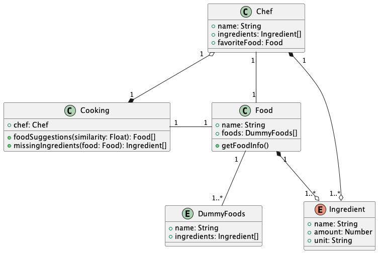

# [Kokki](https://kokki.vercel.app/) 

``The best idea for cooking``

It is a hobby project that tries to find the best meal ideas with ingredients you already have at home.




Technologies used:

- Backend 
  - Node.js
  - Express
  - MongoDB
  - Mongoose
  - Jest
  - ESLint
  - Prettier
  - Husky
  - Lint-staged
  - Docker

- Frontend
  - Vue.js
  - Pinia
  - Vite
  - ESLint
  - Prettier
  - Husky
  - [Icones](https://icones.js.org/collection/lets-icons)
    - https://iconify.design/
  - VueUse
  
- DB
  - MongoDB
  - Mongoose

- Planing & Documentation & Design & Management 
  - PlantUML
  - Trello
  - iThoughtsX
  - Figma

# Installation

## Running the Kokki (MEVN Stack)

```sh
$ docker-compose up
```

## Accessing the Kokki from a browser

The starter Kokki works with a load balancer that binds to ports 80 and 443. It currently serves the domain http://Kokki.localhost. In order to reach the frontend through the Kokki, you need to edit your `hosts` file (usually under `/etc/hosts` in UNIX environments and `C:\Windows\System32\Drivers\etc\hosts` in Windows) and add the following line:

```
127.0.0.1 Kokki.localhost
```

Now if you visit http://Kokki.localhost, you will be greeted with the frontend starter project.

## Changing the local domain

If you wish to use a domain name other than http://Kokki.localhost, simply set the environment variable `DOMAIN` to any domain you want.

```sh
$ DOMAIN=another-domain.localhost docker-compose up
```

You then also need to update your `hosts` file accordingly.

## Debugging

You can debug the backend while it's running in VSCode. Instead of running `docker-compose up`, run the following command:

```sh
$ docker-compose -f docker-compose.yml -f docker-compose.debug.yml up
```

This starts the backend service in the debug mode, so you can use the built-in debug task `Attach to backend` to debug your backend service.

# Running tests

## Running backend tests

```sh
$ cd backend
$ pnpm i
$ pnpm test
```

## Running frontend tests

```sh
$ cd frontend
$ pnpm i
$ pnpm test:unit
$ pnpm test:e2e
```

# Linting

Run `pnpm install` on the root folder and it will set up a pre-commit hook to lint the staged files. You will also have two lint commands, `pnpm lint` and `pnpm lint-staged` that you can run on the root folder.

These commands run the individual `lint` and `lint-staged` scripts in both the `frontend` and the `backend` folders, and they will respect individual configurations of these folders.

# License

MIT License

Copyright (c) 2024 Cihat SALIK

Permission is hereby granted, free of charge, to any person obtaining a copy
of this software and associated documentation files (the "Software"), to deal
in the Software without restriction, including without limitation the rights
to use, copy, modify, merge, publish, distribute, sublicense, and/or sell
copies of the Software, and to permit persons to whom the Software is
furnished to do so, subject to the following conditions:

The above copyright notice and this permission notice shall be included in all
copies or substantial portions of the Software.

THE SOFTWARE IS PROVIDED "AS IS", WITHOUT WARRANTY OF ANY KIND, EXPRESS OR
IMPLIED, INCLUDING BUT NOT LIMITED TO THE WARRANTIES OF MERCHANTABILITY,
FITNESS FOR A PARTICULAR PURPOSE AND NONINFRINGEMENT. IN NO EVENT SHALL THE
AUTHORS OR COPYRIGHT HOLDERS BE LIABLE FOR ANY CLAIM, DAMAGES OR OTHER
LIABILITY, WHETHER IN AN ACTION OF CONTRACT, TORT OR OTHERWISE, ARISING FROM,
OUT OF OR IN CONNECTION WITH THE SOFTWARE OR THE USE OR OTHER DEALINGS IN THE
SOFTWARE.
